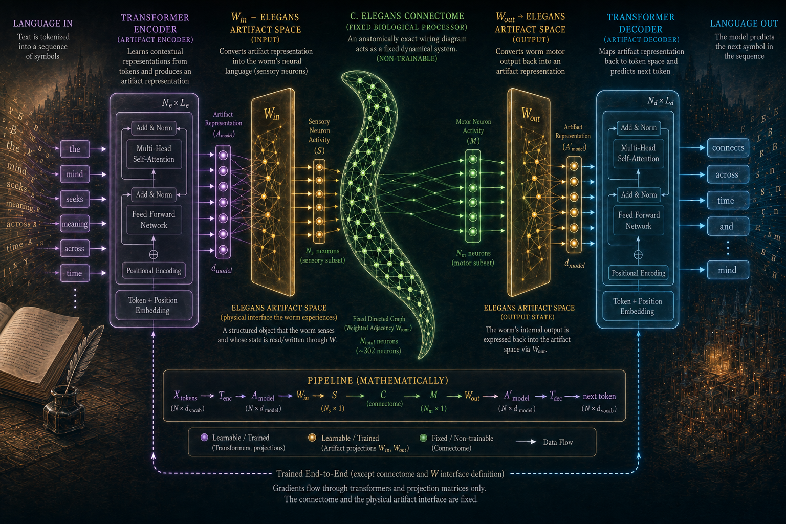

# 🪱 ConnectomeGPT-Worm

### A language model with a biological detour.

Developed by **Dr. Myles Douglas Garvey** — Self-Funded AI Researcher

📧 [drmylesgarvey@gmail.com](mailto:drmylesgarvey@gmail.com)

[](https://doi.org/10.5281/zenodo.22545299)

[](https://github.com/drmylesgarveylabs/connectome-gpt-worm)
[](https://huggingface.co/drmylesgarveylabs/connectome-gpt-worm)
[](https://doi.org/10.5281/zenodo.22545299)



---
---

## 📌 Contents

* [🧠 Overview](#-overview)
* [🧬 Biological Substrate](#-biological-substrate)
* [🏗️ Architecture](#️-architecture)

  * [Technical Specifications](#technical-specifications)
* [🧪 Experimental Design](#-experimental-design)

  * [🌐 Group A: Structural Integrity](#-group-a-structural-integrity)
  * [🔍 Group B: Ablations & Alterations](#-group-b-ablations--alterations)
* [📊 Evaluation & Benchmarks](#-evaluation--benchmarks)
* [💾 Dataset & Training](#-dataset--training)

  * [Hyperparameters](#-hyperparameters)
* [🔬 Reproducibility](#-reproducibility)
* [⚠️ Limitations](#️-limitations)
* [📜 Preprint & Citation](#-preprint--citation)
* [👤 Author](#-author)
* [📁 Repository](#-repository)

---

## 🧠 Overview

**ConnectomeGPT-Worm** is an experimental GPT-style language model that embeds the actual biological neural circuitry of the roundworm (*C. elegans*) directly into its computational architecture.

### The Core Question

> **Can biological evolutionary engineering provide a useful inductive bias for next-token prediction?**

### The Mechanism

The model acts as a hybrid system, routing linguistic information through a biological neural network before generating language.

Unlike a conventional transformer, where hidden representations are transformed exclusively through learned mathematical operations, ConnectomeGPT-Worm introduces a **fixed anatomical connectome as an intermediate computational layer**.

The model must therefore learn:

1. A projection from linguistic representation into biological neuronal space.
2. A transformation through the *C. elegans* connectome.
3. An inverse projection from biological representation back into linguistic representational space.
4. A final transformation into next-token probabilities.

The accompanying preprint describes this as a **Generative Biologically-Pretrained Transformer (GBT)** architecture.

### The Biological Detour

```text
Language Input
      │
      ▼
Transformer Encoder
      │
      ▼
┌───────────────────────────┐
│   C. elegans Connectome   │
│                           │
│       302 neurons         │
│      ~5,000 edges         │
│                           │
│  Biological Connectivity │
└─────────────┬─────────────┘
              │
              ▼
Transformer Decoder
      │
      ▼
Language Output
```

The biological network is therefore not merely training data or an analogy.

**It is an architectural component of the model.**

---

## 🧬 Biological Substrate

The biological layer uses the neural connectome of the nematode ***Caenorhabditis elegans***.

The network contains:

* **302 neurons**
* Approximately **5,000 connections**
* Anatomically derived connectivity
* Chemical synaptic connections
* Synaptic counts represented as edge weights

The underlying biological network is derived from the **OpenWorm / CElegansNeuroML** ecosystem.

The biological connectivity therefore serves as a **structural prior** imposed upon the otherwise learned language model.

Rather than asking a neural network to discover an arbitrary intermediate graph, the experiment asks whether an existing biological graph contains computational structure that can be exploited by a language model.

---

## 🏗️ Architecture

A conventional language model can be represented approximately as:

```text
Embeddings
    │
    ▼
Transformer
    │
    ▼
Next-Token Prediction
```

ConnectomeGPT-Worm introduces a biological intermediate representation:

```text
                         ┌─────────────────────┐
Language Input ─────────►│ Transformer Encoder │
                         └──────────┬──────────┘
                                    │
                                    ▼
                         ┌─────────────────────┐
                         │ Biological          │
                         │ Connectome          │
                         │                     │
                         │ 302 neurons         │
                         │ ~5,000 connections  │
                         └──────────┬──────────┘
                                    │
                                    ▼
                         ┌─────────────────────┐
                         │ Transformer Decoder │
                         └──────────┬──────────┘
                                    │
                                    ▼
                              Language Output
```

The biological layer is normalized so that its largest eigenvalue is **1.0**, providing spectral control over signal propagation through the connectome.

### Technical Specifications

| Component                     | Specification                                        |
| ----------------------------- | ---------------------------------------------------- |
| **Architecture**              | Generative Biologically-Pretrained Transformer (GBT) |
| **Model Type**                | GPT-style language model                             |
| **Hidden Dimensions**         | 256                                                  |
| **Attention Heads**           | 4                                                    |
| **Context Window**            | 1,024 tokens                                         |
| **Biological Layer**          | *C. elegans* connectome                              |
| **Biological Neurons**        | 302                                                  |
| **Connectome Connectivity**   | ~5,000 connections                                   |
| **Connectome Initialization** | Biological synaptic weights                          |
| **Connectome Default State**  | Frozen                                               |
| **Connectome Normalization**  | Largest eigenvalue = 1.0                             |

---

## 🧪 Experimental Design

Seven distinct configurations were tested across **five independent random seeds** over **10,000 training steps**.

The experimental matrix is designed to distinguish the effects of:

* biological topology
* biological synaptic weights
* biological input/output pathways
* network scale
* connectome trainability
* and the presence of the biological layer itself

---

## 🌐 Group A — Structural Integrity

### Experiment 1 — The Real Thing (Fixed)

The actual *C. elegans* connectome is loaded using biological synaptic weights and **frozen**.

The transformer must therefore learn to compute around the fixed biological structure.

This represents the primary **biological inductive-bias condition**.

### Experiment 2 — Connectome Head Start (Trainable)

The connectome is initialized using biological synaptic weights but is subsequently allowed to adapt through backpropagation.

This tests whether biological initialization provides a useful starting point even when the network is ultimately trainable.

### Experiment 3 — The Impostor (Random Weights)

The biological network's sparsity and topology are preserved, but its synaptic weights are randomized.

This separates the contribution of:

**biological topology**

from

**biological weight structure.**

---

## 🔍 Group B — Ablations & Alterations

### Experiment 4 — Zooming Out (Subsets)

The connectome is reduced to increasingly smaller subsets of highly interconnected neurons.

Tested configurations:

* **Top 50 neurons**
* **Top 100 neurons**
* **Top 200 neurons**

This probes how the computational effect changes with biological network scale.

### Experiment 5 — Wrong Doors (Arbitrary I/O)

The biological connectome remains real and fixed, but the model bypasses the expected sensory/motor pathways and instead uses arbitrary entry and exit points.

Three configurations are tested:

* **5a — Arbitrary Inputs**
* **5b — Arbitrary Outputs**
* **5c — Both Inputs and Outputs Randomized**

This tests whether the specific organization of biological input/output pathways contributes to model performance.

### Experiment 6 — Thawing the Worm (Phase 2)

Experiment 1 is first fully trained with the connectome frozen.

The transformer is then frozen while **only the biological connectome is unfrozen** for an additional 10,000 tuning steps.

This asks whether the biological layer itself can subsequently adapt to the linguistic task.

### Experiment 7 — No Worm at All (Dense Baseline)

The biological connectome is removed entirely.

It is replaced with a standard, fully connected feedforward layer with equivalent parameter width.

This provides the direct conventional neural-network baseline.

---

## 📊 Evaluation & Benchmarks

Models are evaluated every **50 training steps**.

### 1. Perplexity — WikiText-103

**Perplexity (PPL)** measures uncertainty in next-token prediction.

**Lower is better.**

WikiText-103 provides the primary language-modeling benchmark.

### 2. MMLU Accuracy

Models are evaluated across eight academic subject categories, including:

* High School Biology
* College Biology
* Chemistry
* Physics
* Computer Science
* Abstract Algebra

The evaluation uses four-choice questions, giving a **25% random-guessing baseline**.

---

## 💾 Dataset & Training

### Linguistic Data

**WikiText-103**

The language corpus contains more than **100 million tokens** derived from featured Wikipedia articles.

Text is tokenized using the GPT-2 tokenizer.

```text
Vocabulary Size: 50,257 tokens
```

### Biological Data

The biological network is derived from the ***C. elegans* hermaphrodite connectome**.

The source consists of an edge list containing chemical synaptic connections, with synaptic counts represented as edge weights.

**Source:**

```text
OpenWorm / CElegansNeuroML
```

---

## ⚙️ Hyperparameters

| Parameter                | Value                                 |
| ------------------------ | ------------------------------------- |
| **Hardware**             | 1 × NVIDIA A100 80GB                  |
| **Batch Size**           | 32 sequences × 1,024 tokens           |
| **Optimizer**            | AdamW                                 |
| **β₁**                   | 0.9                                   |
| **β₂**                   | 0.95                                  |
| **Weight Decay**         | 0.01                                  |
| **Learning Rate**        | 3 × 10⁻⁴                              |
| **LR Schedule**          | 500-step linear warmup → cosine decay |
| **Minimum LR**           | 10% of initial LR                     |
| **Precision**            | Native bfloat16                       |
| **Training Steps**       | 10,000                                |
| **Evaluation Frequency** | Every 50 steps                        |
| **Random Seeds**         | 42, 123, 456, 789, 1337               |

---

## 🔬 Reproducibility

The experimental design uses five independent random seeds:

```text
42
123
456
789
1337
```

Seven architectural configurations are evaluated under a common training framework.

This allows the experimental analysis to distinguish architectural effects from stochastic variation associated with initialization and optimization.

The repository contains the experimental research code and model configurations associated with the ConnectomeGPT-Worm experiments.

---

## ⚠️ Limitations

### Scale Threshold

At a hidden dimension of 256, this model operates well below the scale at which robust downstream reasoning typically emerges.

Consequently, small variations across random seeds may have substantial effects on MMLU performance.

### Domain Mismatch

The *C. elegans* nervous system evolved for biological functions including:

* locomotion
* chemotaxis
* environmental sensing
* feeding
* survival-related behavior

It did not evolve to process human language.

Any benefit observed from the connectome therefore represents an **architectural effect**, rather than evidence that the biological network is inherently optimized for language.

### I/O Mapping Sensitivity

The model projects a continuous mathematical representation into a discrete set of biological neurons.

The choice of which neurons serve as input and output interfaces therefore introduces substantial architectural and experimental-design assumptions.

---

## 📜 Preprint & Citation

The formal research associated with ConnectomeGPT-Worm is available as a Zenodo preprint.

### Preprint

**Garvey, Myles (2026).**

*Connectome-GPT-Worm: Fine-Tuning a Generative Biologically Trained (GBT) Model: Using the C. elegans Connectome for Language-Based Problems and Large Language Modelling.*

Zenodo. Published September 6, 2026.

**DOI:** `10.5281/zenodo.22545299`

[Connectome-GPT-Worm Preprint — Zenodo](https://zenodo.org/records/22545299?utm_source=chatgpt.com)

### DOI Badge

```markdown
[](https://doi.org/10.5281/zenodo.22545299)
```

### BibTeX

```bibtex
@article{garvey2026connectome,
  title     = {Connectome-GPT-Worm: Fine-Tuning a Generative Biologically
               Trained (GBT) Model: Using the C. elegans Connectome
               for Language-Based Problems and Large Language Modelling},
  author    = {Garvey, Myles},
  year      = {2026},
  publisher = {Zenodo},
  doi       = {10.5281/zenodo.22545299},
  url       = {https://doi.org/10.5281/zenodo.22545299},
  note      = {Preprint}
}
```

### Biological Reference

The underlying biological modeling work should also be credited:

```bibtex
@article{gleeson2018c302,
  title={c302: a multiscale framework for modelling the nervous
         system of Caenorhabditis elegans},
  author={Gleeson, Padraig and others},
  journal={Philosophical Transactions of the Royal Society B:
           Biological Sciences},
  year={2018}
}
```

---

## 🧬 Relationship to NIRGEN

ConnectomeGPT-Worm is also part of the broader research program examining whether biological structure can be treated as a **computational substrate rather than merely an inspiration for artificial neural networks**.

The ConnectomeGPT-Worm preprint is explicitly recorded by Zenodo as a variant work related to the earlier NIRGEN preprint, *Shadows of Consciousness*.

Where **NIRGEN** investigates neural computation from the level of:

```text
ions → receptors → compartments → vesicles → neural computation
```

ConnectomeGPT-Worm investigates biological structure at a higher organizational level:

```text
neurons → connectome → representation → language computation
```

The two projects therefore examine different levels of biological organization within the same broader research question:

> **What computational information is lost when biological neural systems are reduced to abstract mathematical operations?**

---

## 📁 Repository

The complete experimental repository is available here:

[ConnectomeGPT-Worm — GitHub Repository](https://github.com/drmylesgarveylabs/connectome-gpt-worm?utm_source=chatgpt.com)

The repository currently contains the README, architecture representation, and associated experimental materials.

---

## 👤 Author

**Dr. Myles Douglas Garvey**
Independent / Self-Funded AI Researcher

📧 **[drmylesgarvey@gmail.com](mailto:drmylesgarvey@gmail.com)**

**GitHub:**
[drmylesgarveylabs](https://github.com/drmylesgarveylabs?utm_source=chatgpt.com)

**Preprint:**
[Zenodo — Connectome-GPT-Worm](https://zenodo.org/records/22545299?utm_source=chatgpt.com)

---

## 🔬 Project Status

**Status:** Experimental Research

**Architecture:** Generative Biologically-Trained Transformer (GBT)

**Biological substrate:** *Caenorhabditis elegans*

**Primary language benchmark:** WikiText-103

**Secondary benchmark:** MMLU

**Experimental configurations:** 7

**Independent random seeds:** 5

**Training horizon:** 10,000 steps per configuration

**Preprint DOI:** `10.5281/zenodo.22545299`

---

*ConnectomeGPT-Worm is an experimental research architecture investigating whether biological neural connectivity can serve as an inductive bias for artificial language modeling.*
